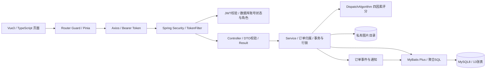
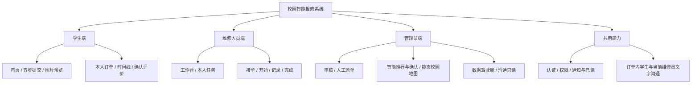
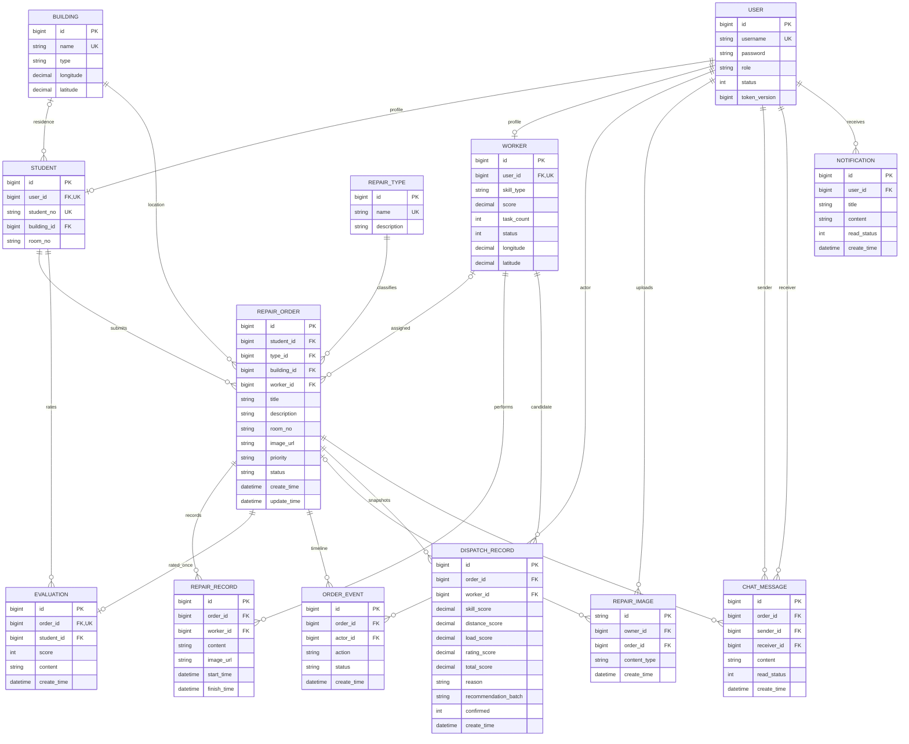
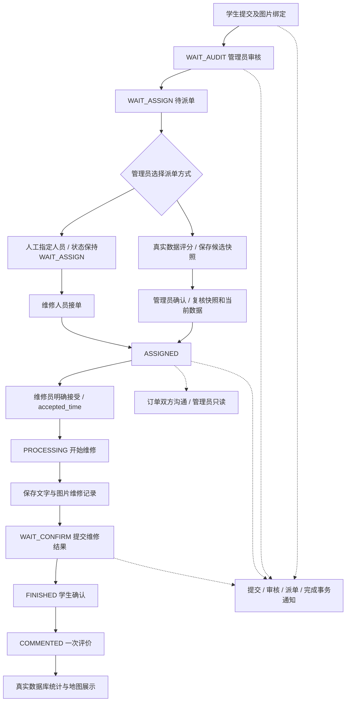

# 最终系统架构与毕业设计说明

以当前Phase1～6源码为准，保留单后端、单前端、三角色及既有状态机。所有图均为文档中的Mermaid源，可在支持Mermaid的Markdown阅读器中查看或导出，不安装绘图工具。

## 系统架构图

登录是唯一公开认证入口，健康检查公开；其他接口需JWT。角色路径由Security限制，订单、聊天、图片、通知进一步按数据归属验证。角色以数据库当前值为准，禁用账号或token_version变化可拒绝旧令牌。客户端角色与路由保护负责用户体验，不能代替服务端权限。

响应统一为`{code,message,data}`，图片为受限二进制响应。分页最大100，聊天最近100条、通知最近50条、地图最多500单。数据库事务包含状态、事件、图片绑定、必要通知等写入；失败整体回滚。

## 功能结构图

前端统一系统字体、蓝色强调、浅色留白、圆角和轻阴影；组件复用而非后台模板。路由按需加载；地图、图表使用SVG/CSS。通知与聊天没有轮询或WebSocket，提供手动刷新。

## ER图

USER.password保存BCrypt哈希。ER图列出核心字段，完整字段以sql/*.sql为准。worker_id/坐标/未绑定图片的order_id可为空；每单评价唯一。关联删除被外键限制，当前没有通用删除业务接口。

## 核心流程图

重复审核、派单、开始、完成、确认或评价在当前状态不匹配时返回409，不重复写事件/评价。时间线只展示真实事件，并按维修轮次折叠历史，不根据状态补造节点。

## 智能派单与创新点

`totalScore = skillScore × 0.4 + distanceScore × 0.3 + loadScore × 0.2 + ratingScore × 0.1`。

| 因素 | 规则 |
| --- | --- |
| 技能 | 精确故障类别/领域关键词100；综合维修70；其他或未知领域50；不匹配0 |
| 距离 | WGS84 Haversine公里距离，100/(1+距离km)；无合法坐标计0并解释 |
| 负载 | 100/(1+当前已分配未处理完任务数)，不使用累计task_count冒充负载 |
| 历史评价 | 真实历史均分×20；无评价中性50 |

候选按总分降序、距离升序、id升序确定性排序。每次推荐保存完整批次及解释；10分钟内确认并重新检查原始输入、各分项、可用状态和订单。人工决策保留，算法不直接越过管理员操作。

可作为本科设计创新点讨论：

1. **可解释的人机协同派单。** 评分规则透明，推荐记录支持追踪和论文分析；不是AI模型，未做预测或最优路线证明。
2. **空间化校园服务展示。** 静态坐标映射、重叠点展开、状态图层与详情联动；无需SDK或密钥，坐标数据缺失时不制造位置。
3. **可追溯业务闭环。** 订单事件、维修记录、评价、绑定聊天及事务通知形成完整证据链。
4. **轻量交付。** 单体分层、组件复用、本地SVG、短而有效的验收入口；本轮减少冗余查询并保留安全边界。

## 统计口径

自然日为Asia/Shanghai。今日报修按create_time；处理中为ASSIGNED/PROCESSING/WAIT_CONFIRM/REWORK_PENDING；完成率为FINISHED+COMMENTED / 全部工单；平均维修时间按每个订单、维修轮次的记录开始至结果完成时间，不含审核或等待确认时间。趋势最近14天，完成曲线按FINISH事件；人员完成数量按学生已确认状态，评分直接读取evaluation。上述口径在页面描述中保留，不把“提交维修结果”和“学生确认”混为同一指标。

## 最终优化边界

本轮只修改冗余查询、前端竞态/错误处理、展示与交付资料。Phase6最终优化保留JWT、权限模型、派单公式和地图逻辑；后续异常协同流程仅增加必要状态与附加信息，见business-enhancements.md。详见[审查及验证](phase6-validation.md)与[答辩指南](defense-guide.md)。
